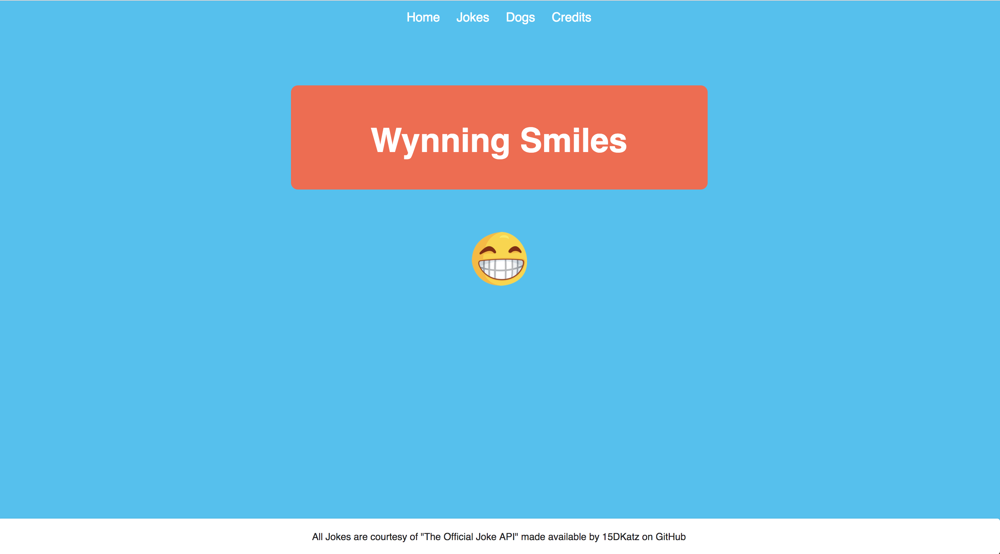
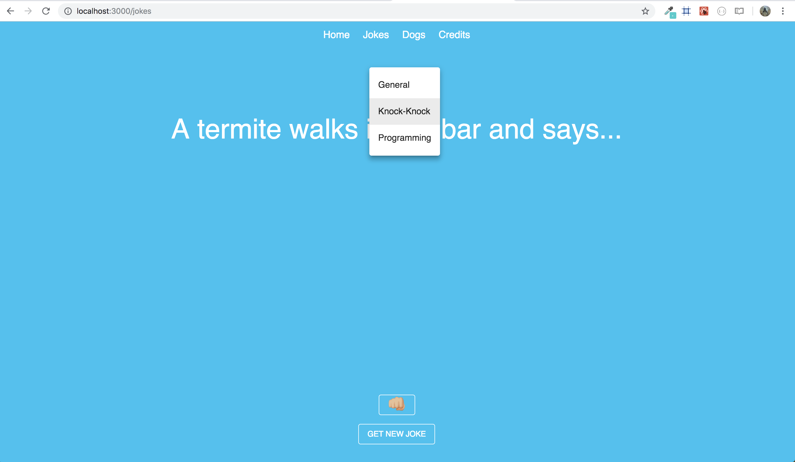
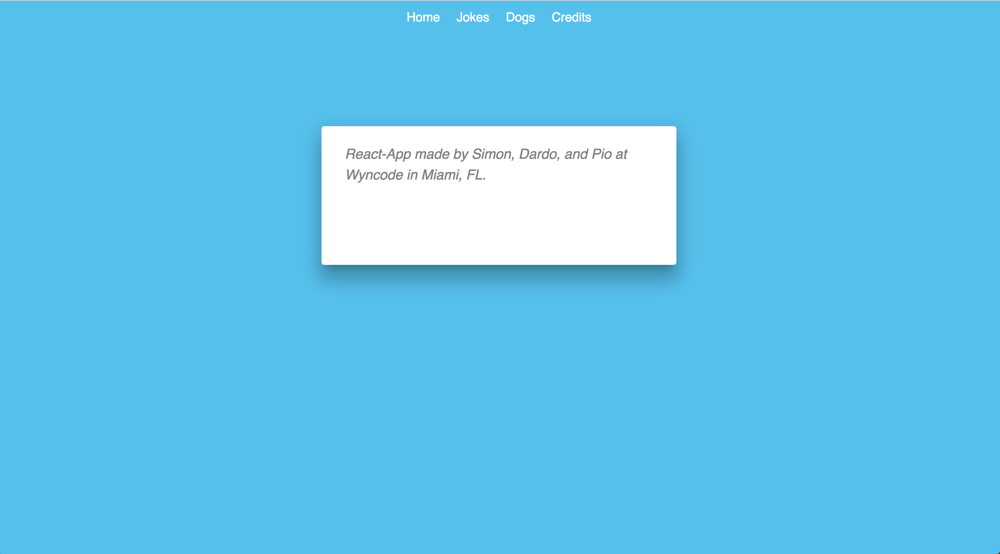

# Wyncode Friends and Family Project

This project was created for Wyncode's Friends & Family presentation on September 13th, 2018

### About
* This project was created using React in less than a weeks time.
* The application uses an express backend server to send get requests to this api: https://github.com/15Dkatz/official_joke_api and serve the jokes to the front end.
* Many of the styling components are from the React Material-UI library.
* You can visit a live demo of this application at https://wynningsmiles.herokuapp.com/

## Home

## Jokes Page

## Credits

